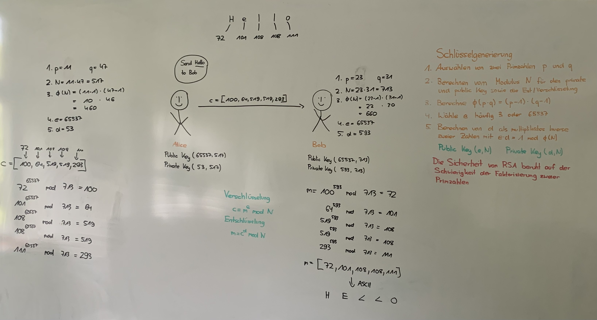

### RSA Verschlüsselung

---

Dieses Repository dient dem besseren Verständnis der RSA Verschlüsselung von Nachrichten.
Es handelt sich nicht um eine sichere Bibliothek für Verschlüsselung sondern soll nur das Prinzip verdeutlichen.

Der Code kann mittels mathematischer Operationen eigene Schlüssel generieren und Strings mit Ver- und Entschlüsseln

##### Funktionen
- Primzahlen generieren (p und q) mit einer Anzahl von n Bits
- e kann auf einen gemeinsamen Wert festgelegt werden (Default: 65573 - BigInteger)
- Berechnung Public und Private Key Anhand der Primzahlen p und q
- Verschlüsseln von Strings mit dem Public Key
- Entschlüsseln von Strings mit dem zum Public Key passenden Private Key
- Public Key Austausch über TCP Verbindung
- Senden von verschlüsselten Nachrichten über TCP
- Empfangen von zu entschlüsselnden Nachrichten über TCP
- Output von verschlüsselten Nachricht zum Input an anderer Stelle zu Testzwecken
- Input von mit dem eigenen Public Key verschlüsselten Nachrichten zur Entschlüsselung (Testen der Entschlüsselung)

##### Das Schaubild verdeutlicht die Funktionsweise von RSA bzw. der durchgeführten mathematischen Operationen. Schaubild von [Soufiane](https://github.com/Soufiane1699)
